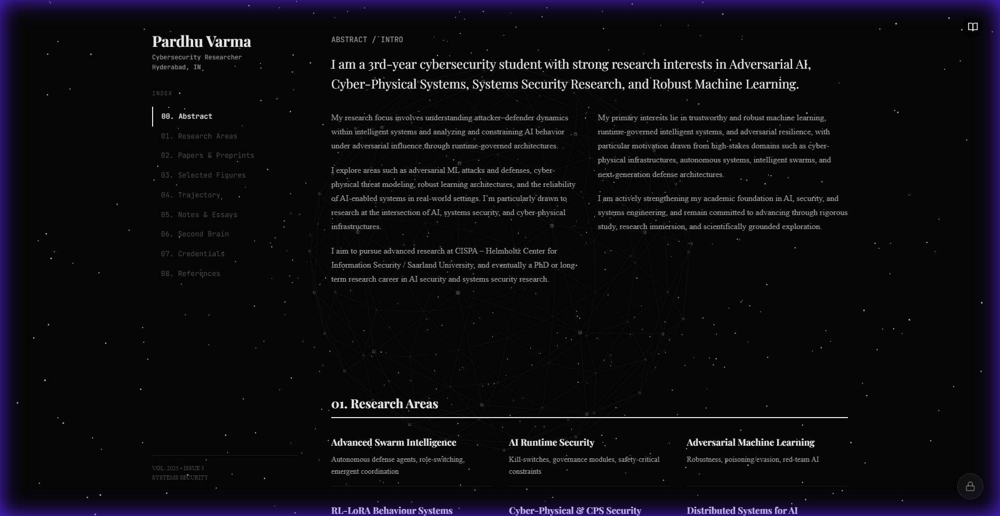
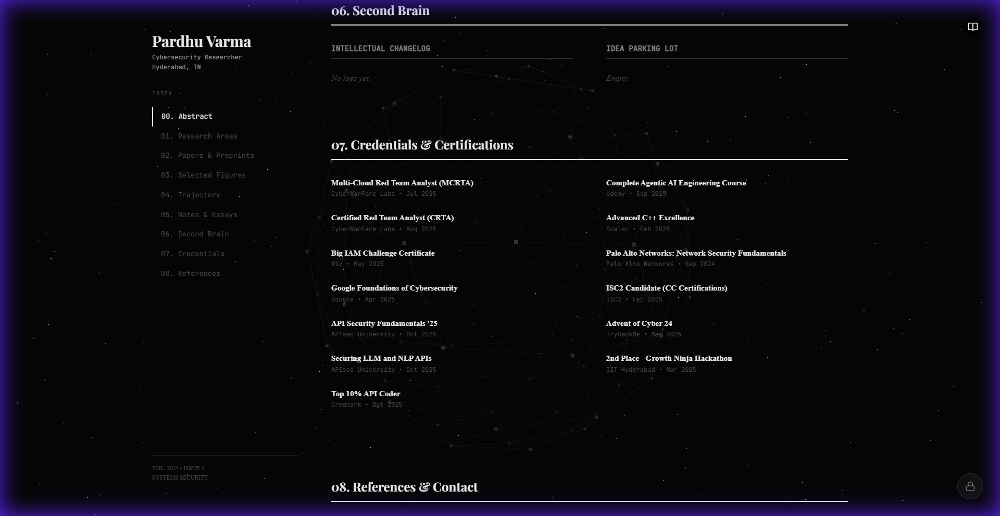
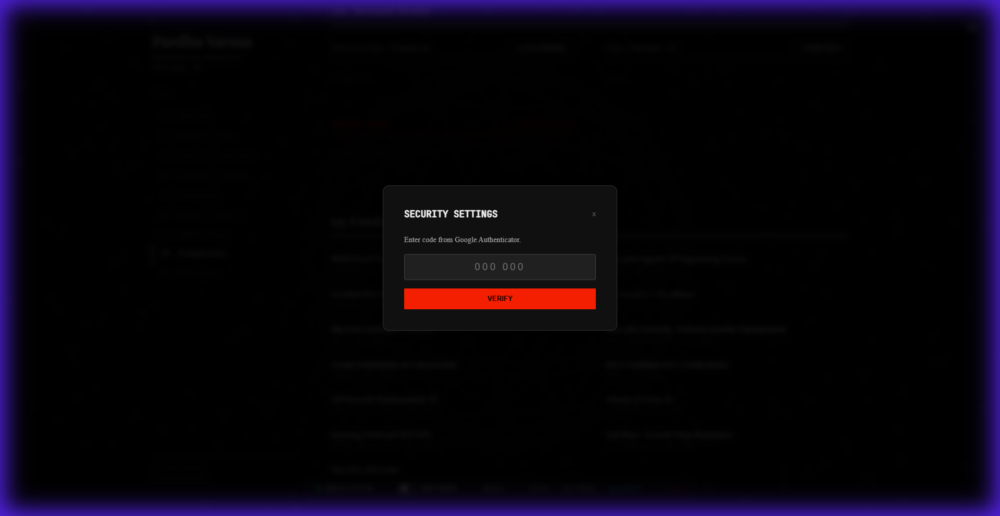
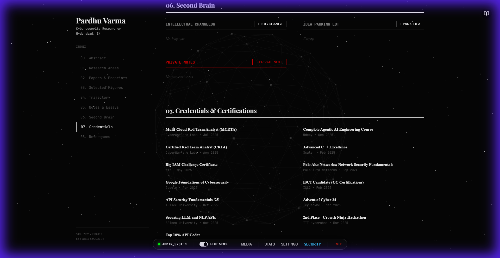

# Researcher's Handbook - My Portfolio



A highly advanced, interactive "Digital Garden" and Portfolio designed for researchers, developers, and thinkers. Features a "Second Brain" for idea management, a secure Admin Dashboard with Biometric Authentication, and a dynamic journal interface.

## 🚀 Features

### 🧠 Second Brain (Digital Garden)
- **Intellectual Changelog**: Track the evolution of your thoughts over time.
- **Idea Parking Lot**:
  - **Public Ideas**: Share your thoughts with the world.
  - **Private Ideas**: Admin-only scratchpad for raw concepts.
- **Micro-Interactions**: Smooth animations and hover effects.



### 🛡️ Advanced Security System
- **Admin Dashboard**: Hidden entry point for authorized users.
- **Biometric Authentication**: Integration with **Windows Hello / Touch ID** (WebAuthn) for high-security actions.
- **Two-Factor Authentication (TOTP)**: Compatible with Google Authenticator for password updates.
- **Secure Credentials**: Strict wizard flow for updating sensitive data.



### ⚡ Technical Highlights
- **React 19 & Vite**: Blazing fast performance.
- **Three.js**: Subtle background particles and effects.
- **Local Persistence**: Custom `DataContext` with automatic corruption recovery.
- **Responsive Design**: "Bento Grid" layouts and mobile-first approach.

## 📸 Admin Interface
The admin interface provides powerful tools to manage content directly on the live site.



## 🎥 Video Showcase


## 🛠️ Installation

```bash
# Clone the repository
git clone https://github.com/yourusername/researchers-handbook.git

# Install dependencies
npm install

# Run development server
npm run dev
```

## 🔐 Admin Access (Default)
- **Entry**: Click the invisible button at the bottom-right of the screen.
- **Password**: `admin`
- **Setup**: Go to **SECURITY** in the admin bar to set up your Biometrics and 2FA.

---
*Built with ❤️ by Pardhu*
